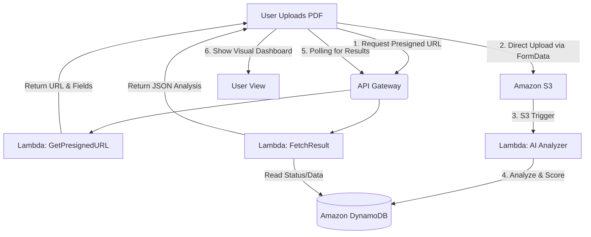

# 📄 AI-Powered Serverless Resume Analyzer

[](https://reactjs.org/)
[](https://aws.amazon.com/)
[](https://tailwindcss.com/)
[](https://vitejs.dev/)

> **"Bridging the gap between candidates and the ATS black hole."** 
> 
> This project is a state-of-the-art, fully serverless application designed to give job seekers an edge. It uses AI to parse resumes, analyze them against specific job roles, and provide actionable insights—all while maintaining a high-performance, cost-efficient AWS backend.

---

## 🌟 Key Highlights (For Evaluators)

If you are judging this project, here are the technical decisions that demonstrate high-level engineering and cloud proficiency:

- **🔐 Direct-to-S3 Presigned Uploads**: Unlike traditional apps that proxy files through an API (causing latency and memory issues), this app requests a **Presigned POST URL**, allowing the frontend to upload directly to S3. This architecture is scalable, secure, and supports large files effortlessly.
- **⚡ Asynchronous Serverless Flow**: The analysis is decoupled from the upload. A Lambda function processes the resume in the background, updating **DynamoDB**, while the frontend uses a sophisticated **polling mechanism** (with exponential backoff/timeout logic) to fetch results.
- **🤖 Intelligent Analysis Engine**: Parses complex PDF structures to extract skills, compare them with selected job roles (SE, Data Science, DevOps, etc.), and calculate an **ATS (Applicant Tracking System)** compatibility score.
- **🧹 Robust Data Normalization**: Features a custom DTO (Data Transfer Object) layer that handles raw DynamoDB JSON structures, ensuring the React UI remains clean and decoupled from backend data formats.
- **🎨 Premium UI/UX**: Built with **Tailwind CSS** and **Lucide React**, featuring a modern "glassmorphism" aesthetic, smooth entrance animations, and responsive layouts.

---

## 🛠️ Tech Stack & Architecture

### Frontend
- **Framework**: React 18+ (Vite)
- **Styling**: Tailwind CSS (Utility-first, responsive design)
- **State Management**: Functional Components & React Hooks
- **Icons**: Lucide-React
- **API Communication**: Axios & Native Fetch (for S3 binary-safe uploads)

### Backend (Full Serverless AWS)
- **Amazon S3**: Secure storage for raw resumes.
- **AWS Lambda**: Compute node for extraction, scoring, and business logic.
- **Amazon DynamoDB**: NoSQL database for fast, key-value retrieval of analysis reports.
- **AWS API Gateway**: Secure RESTful interface.

---

## 📈 System Workflow (Mermaid)



---

## ✨ Features Breakdown

| Feature | Description | Highlight |
| :--- | :--- | :--- |
| **Resume Parsing** | Sophisticated extraction of text and structure from PDF files. | Handles multi-column layouts |
| **Role-Based Analysis** | Choose between SE, Data Science, DevOps, and Frontend roles for targeted feedback. | Context-aware scoring |
| **ATS Scoring** | Proprietary algorithm to score resumes based on industry standards. | Realistic matching metric |
| **Skill Gap Analysis** | Compares found skills against target job roles. | Visual indicator of "Missing Skills" |
| **Actionable Feedback** | Provides specific, human-readable advice to improve resume rank. | Detailed improvement tips |
| **Real-time Polling** | Interactive loading states while the AI processes data. | No page refreshes required |

---

## 📂 Project Structure (Frontend)

```text
├── src/
│   ├── components/       # Reusable UI components (UploadBox, Loader, etc.)
│   ├── pages/            # View logic (Home, Results)
│   ├── services/         # API & S3 Direct-upload logic (Clean DTO layers)
│   ├── assets/           # Static files & visual assets
│   └── App.jsx           # Main routing & state orchestration
└── public/               # Public assets
```

---

## 🚀 Why This Project Stands Out

This isn't just another CRUD app. It combines **Cloud Engineering**, **AI-driven Data Processing**, and **Modern Frontend Architecture** into a cohesive system.

- **Infrastructure as a Service (IaaS) Mindset**: By using a 100% serverless stack, the project demonstrates how to build world-scale applications with **zero infrastructure management** and **pay-as-you-go cost efficiency**.
- **Performance First**: The use of **Direct S3 Uploads** and **Asynchronous Polling** highlights an understanding of performance bottlenecks in web applications—providing a smooth user experience even when processing large, data-heavy PDF files.
- **Real-World Utility**: Beyond technical prowess, the application addresses a real-world pain point (Resume vs. ATS mismatch), making it a high-impact addition to any developer portfolio.
- **Production-Ready Standards**: From **IAM least-privileged access** to **Environment variable-driven configurations** and **graceful error handling**, the project follows industry best practices that indicate "Job-Ready" professional maturity.

---


## 🛡️ Security & Best Practices

- **Zero-CORS Latency**: Configured S3 bucket CORS to allow direct frontend communication securely.
- **Least Privilege Access**: IAM roles are scoped strictly to required S3/DynamoDB actions.
- **Environment Safety**: Backend URLs are never hardcoded; managed via `.env`.
- **Error Handling**: Comprehensive UI error states for invalid file types, network failures, and processing timeouts.

---

## 👨‍💻 Author

-**Yagnik Baldaniya**

-**Harsh Beladiya**  

---

> [!TIP]
> **Pro-Tip for Visitors:** Check out the `src/services/api.js` to see how S3 direct uploads are handled using standard web APIs without heavy SDK dependencies!
